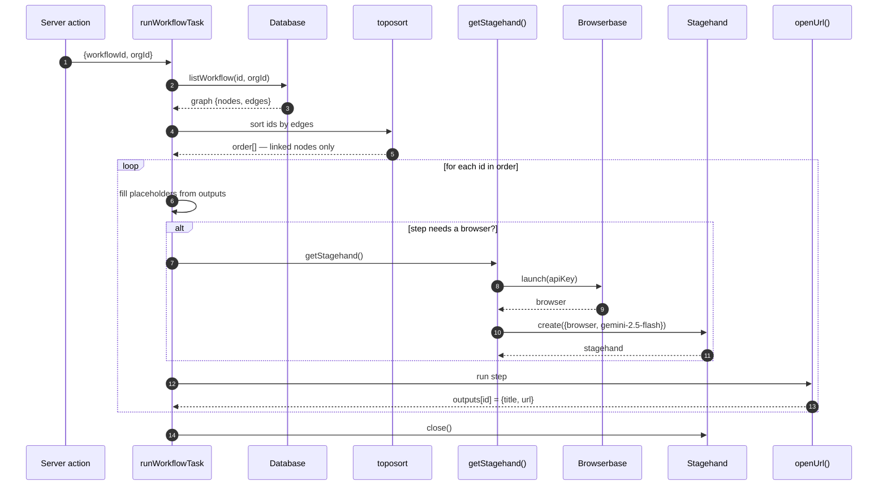
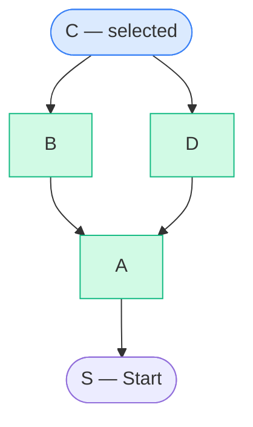

# Workflow Execution — How It Works

> Files: `src/features/workflows/tasks/run-workflow.ts` · `src/features/workflows/hooks/use-upstream-connections.ts` ·
> `src/features/workflows/nodes/node-executor.ts` · `src/features/workflows/nodes/node-registry.ts` ·
> `src/features/workflows/nodes/open-url.ts` · `src/features/workflows/lib/interpolate.ts` ·
> `src/features/workflows/data.ts` · `src/lib/db/schema.ts` · `trigger.config.ts`
>
> Open this file on GitHub to see the diagrams.

## Key terms

| Term                | Meaning                                                |
| ------------------- | ------------------------------------------------------ |
| `{{ nodeId.path }}` | Placeholder you type in a field, filled in at run time |
| `outputs[nodeId]`   | Saved results from steps that already ran              |
| `order[]`           | Run order, dependencies first                          |

---

## Diagram 1 — Canvas and task

You draw boxes on the canvas. The hook lists what past steps will return.
The task runs the boxes in order.

```mermaid
flowchart LR
  subgraph Canvas["Canvas"]
    S([Start])
    A[Open URL 1]
    B[Open URL 2<br/>uses {{A.title}}]
    S --> A --> B
  end

  subgraph Registry["node-registry.ts"]
    R1[start: no outputs]
    R2[open-url: outputs = url, title]
  end

  subgraph Hook["useUpstreamConnections()"]
    H["token: {{ A.title }}<br/>label: Open URL 1 · Title"]
  end

  subgraph Task["runWorkflowTask"]
    T1[sort order]
    T2[fill placeholders]
    T3[run step]
    T4[browser]
  end

  A -.-> R2
  B -.-> R2
  A --> H
  H --> T2
  T1 --> T2 --> T3 --> T4
```

Note: `B` uses `A`'s title before `A` has run. The hook looks back up the arrows
and lists what will be ready. Each item has a `label` for you and a `token` for the code.

---

## Diagram 2 — Run steps in order



Steps:

1. **Load** — task loads the graph with `WHERE id AND orgId` (`data.ts:14`), so users only run their own workflows.
2. **Sort** — `toposort.array(ids, edges)` (`run-workflow.ts:45-50`) puts dependencies first. Boxes with no links are skipped.
3. **Browser setup** — `getStagehand()` (`60-109`) starts only when needed. It needs `BROWSERBASE_API_KEY` and `GEMINI_API_KEY`, finds `stagehand-extension.zip` in 3 places, opens a remote browser, and links Gemini `google/gemini-2.5-flash`. The import is done late to keep start-up fast.
4. **Fill text** — before each step, `interpolate({ text, outputs })` (`interpolate.ts:17`) replaces `{{ ... }}`. Missing value becomes `""`. Objects become JSON.
5. **Run** — `nodeExecutors[type]` picks the step code. Only `open-url` exists now: reuse tab, check URL with `new URL(url)`, open page with 30s limit, return `{ title, url }`.
6. **Close** — `finally` always closes the browser session. Unknown step types are skipped.

---

## Diagram 3 — How the picker finds past steps

Example:

```
Start(S) -> A -> B -> C (selected)
                 A -> D -> C
```



Walk (`use-upstream-connections.ts:38-53`):

| Step      | To check | Found                  | Saved list                        |
| --------- | -------- | ---------------------- | --------------------------------- |
| start     | `[C]`    | —                      | `[]`                              |
| check `C` | `[B,D]`  | `B,D`                  | `[B,D]`                           |
| check `B` | `[D,A]`  | `A`                    | `[B,D,A]`                         |
| check `D` | `[A]`    | `A` already seen, skip | `[B,D,A]`                         |
| check `A` | `[S]`    | `S`                    | `[B,D,A,S]`                       |
| make rows | —        | —                      | `B→2, D→2, A→2, S→0` = **6 rows** |

Closest steps come first. `Start` gives 0 rows since it has no outputs.
The `seen` set stops repeats and loops.

```ts
// one past step becomes N picker rows
ancestors.flatMap((node) =>
  nodeRegistry[node.data.type].outputs.map((output) => ({
    token: `{{ ${node.id}.${output.path} }}`, // uses ID, stays valid on rename
    label: `${node.data.title} · ${output.label}`, // uses title, easy to read
    nodeType: node.data.type, // picks the icon
  })),
)
```

`token` uses the stable ID. `label` uses the name you can change.
If you delete a past step, its old token stays in the text and becomes `""` at run time.

---

## Short version

You link boxes. The hook looks back and offers `{{ id.path }}` items.
At run time the task loads the same links, sorts them, fills each text from past
results, runs each step, saves each result, and closes the browser.
